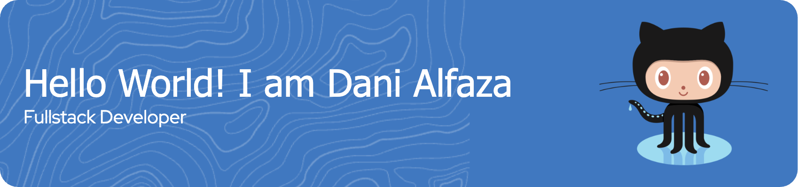

# 👋 Hi, I'm Dani Alfaza

💻 Passionate about backend development, microservices architecture, and leading high-impact engineering teams.

---

🧩 Architecting solutions, leading squads, and writing scalable code.  
🏦 Specialized in backend development for high-performance financial systems.

---

## 🧑‍💼 About Me

I'm a seasoned backend developer and technical lead with strong experience in designing and implementing scalable microservices. I lead a squad of engineers to deliver secure, high-availability systems that empower millions of users.

I thrive in **Agile** environments, bridge business needs with technical execution, and always advocate for clean, maintainable code.

---

## 🔧 Tech Stack & Tools

### 🛠️ Languages & Frameworks
  

### 🧰 Tools & Platforms
  
    
 

---

## 📊 GitHub Stats

  
  

---

## 📈 Currently Working On

- 🛠 Designing fault-tolerant microservices
- 📦 Containerizing applications 
- 📈 Monitoring system health
- 🤝 Leading and mentoring squads to drive consistent engineering excellence

---
## 📫 Let's Connect

- 📧 Email: [alfazadani@gmail.com]
- 💼 LinkedIn: [linkedin.com/in/ahmad-dani-alfaza-173a321b1/] 

---